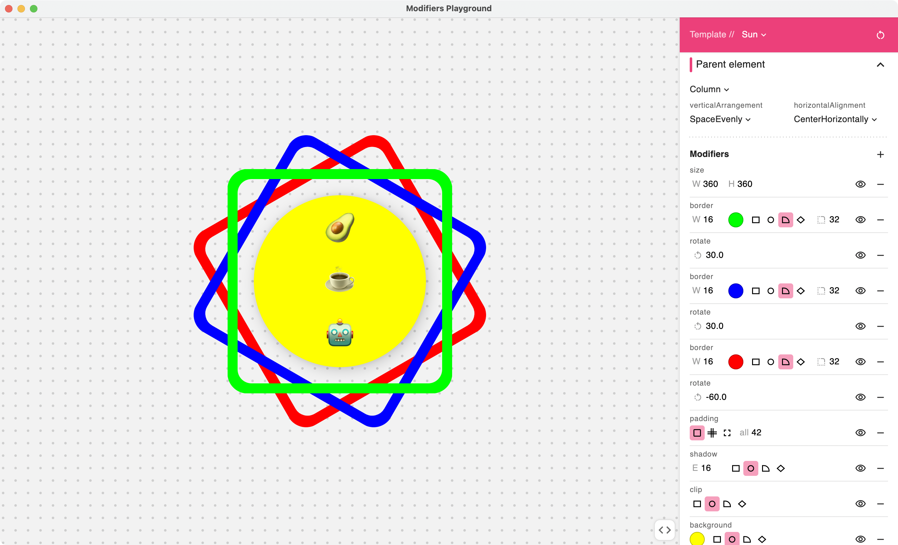

# Compose Modifiers Playground
Source code for [Compose Modifiers Playground IDEA plugin](https://plugins.jetbrains.com/plugin/16417-compose-modifiers-playground)

Learn how to use Jetpack Compose modifiers through this interactive playground!

- Quickly reorder, hide/show, and experiment with modifiers 
- Code is generated as you go, allowing you to copy/paste directly to Android Studio.

The playground comes with several templates to start experimenting from. The tool can be found under the **Tools menu**.

Available modifiers to use:
- align
- alpha
- aspectRatio
- background
- border
- clickable
- clip
- fillMaxHeight
- fillMaxSize
- fillMaxWidth
- height
- offset
- padding
- rotate
- scale
- shadow
- size
- weight
- width
- wrapContentHeight
- wrapContentSize
- wrapContentWidth
